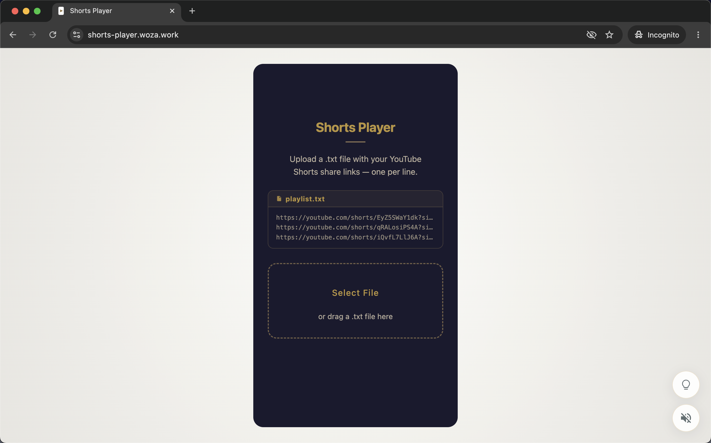
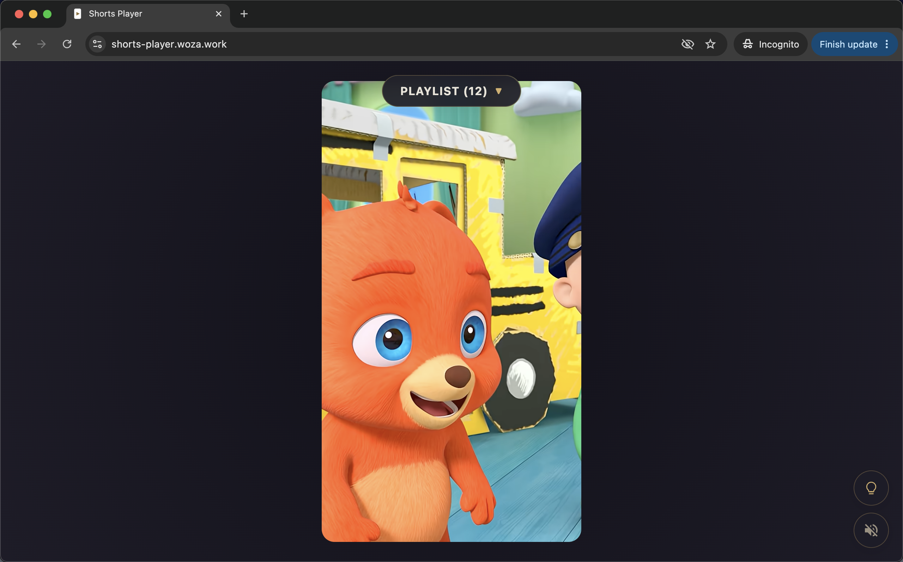
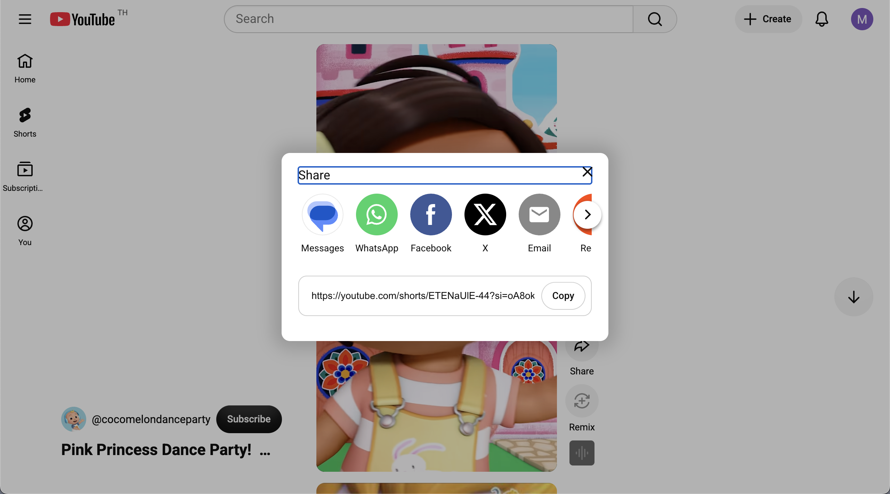
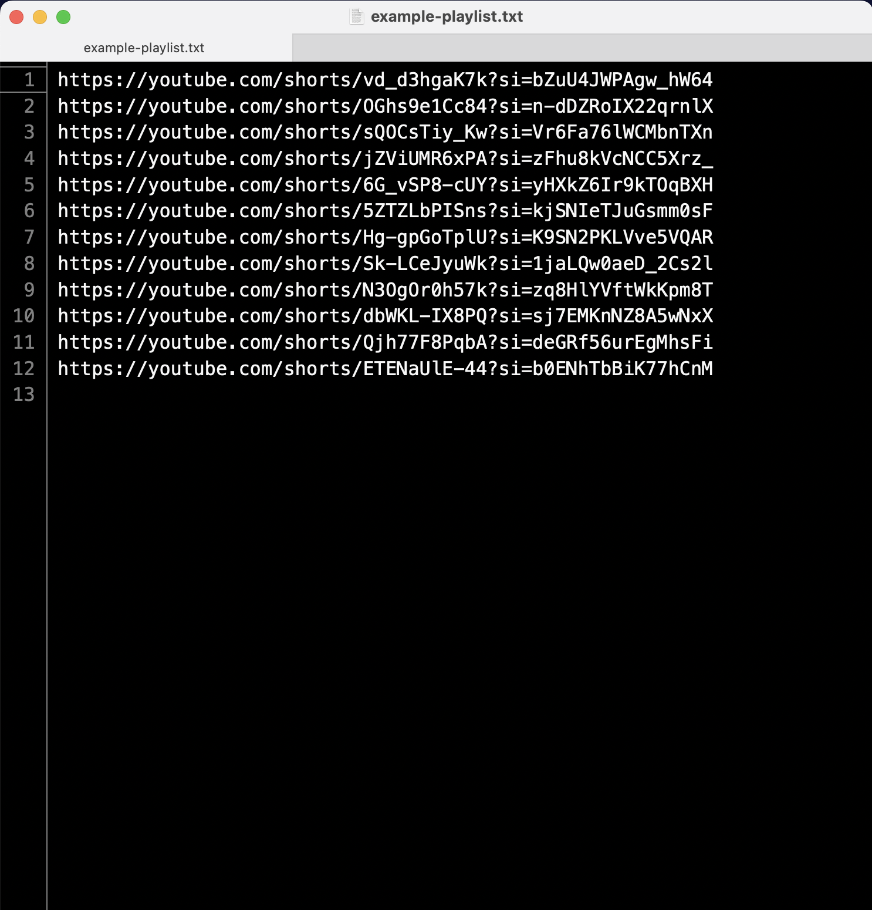

# YouTube Shorts Player
A minimalist, browser-based, vertical scroll Shorts player for custom playlists.

- The scrolling habit without the harm.
- Scroll through your homemade short video mixtapes - no ads or toxic content.
- Upload a txt file with a list of YouTube Shorts links to get started.
- Uses familiar TikTok scroll mechanics.
- Can be hosted online or launched from the desktop.
- Playlists are easy to share.
- Project folder includes an example playlist for testing.

Online demo:<br>
https://shorts-player.woza.work/


<br>

<p>Landing page - light mode</p>

<br>

<p>Dark mode</p>

<br>

<p>How to get the video link</p>

<br>

<p>Example txt file with list of video links</p>

<br>

## How to run the app

The code needs to be on a server for the video features to work. You can upload the code to a shared web server, like Dreamhost, or use a local desktop server.

This is how to use the python server on a Mac:

- Open the Terminal.
- Navigate to the folder containing the index.html file.
- Start the server by typing this in the terminal:<br>
```
  python3 -m http.server 8000
```
- Paste this into your web browser to launch the app:<br>
```
  http://localhost:8000/
```
- When you're done, go back to Terminal and press Ctrl+C to stop the server.

<br>

## Notes

- This player depends on the source videos staying up, YouTube's iframe API continuing to work reliably, and YouTube's terms of service continuing to allow their videos to be embedded in websites. Curated short video scrolling as a new content category is plausible, but the concept currently stands on a brittle foundation.
- Over time, the source of toxic techniques may be the video creators themselves. The algorithms are very effective at optimizing for engagement. Creators may start using the same playbook. An ad-free, non-algorithmic feed won't escape that.
- When scrolling backwards, beyond video n-1, the audio is automatically disabled to prevent lagging. When the user re-engages the audio, playback continues smoothly. However, playback still lags when the user tries to re-enable audio when on the n-2 video. The other past videos (n-3, n-4, etc.) work without lagging.

<br>

## References

- Faith Scrolling Web App<br>
https://github.com/vbookshelf/Faith-Scrolling

<br>

## Revision History

Version 1.0<br>
12-July-2026<br>
First release.

<br>
